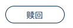

# 按钮

## 功能

实现点击或者跳转页面

## props

| 参数 | 说明 | 必填 | 类型 | 可选值 | 默认值 |
| --- | --- | --- | --- | --- | --- |
| type | 按钮类型 | 否 | String | fill(有填充)/none(无填充)/text(无边框) | none |
| to | 路由跳转，有该属性时为进行路由跳转 | 否 | String/Object(vue-router规则) | — | — |
| disabled | 禁用状态 | 否 | Boolean | true/false | false |

## event

- `click`: 点击后触发的事件

## slot

按钮的内容

## 默认组件名

`jd-button`

## 样式

- `fill`

- `none`

- `text`

