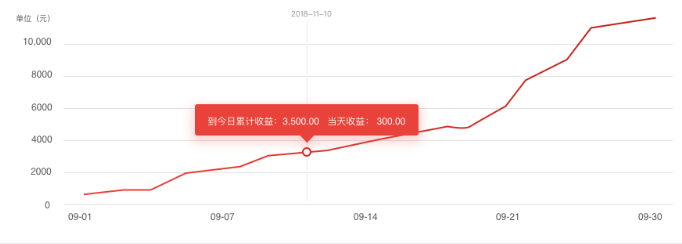

# 资产收益图表

## 功能

基于echarts进行的封装，实现资产收益展示功能

## props

| 参数 | 说明 | 必填 | 类型 | 可选值 | 默认值 |
| --- | --- | --- | --- | --- | --- |
| xData | x轴数据 | 否 | Array | - | [] |
| yData | y轴数据 | 否 | Array | - | [] |
| tooltipFormat | tooltip格式化 | 否 | Function | - | - |

```js
xData: [
  new Date(),
  new Date(),
  new Date()
]
yData: [
  '123',
  '321',
  '111.00'
]
tooltipFormat: (params, ticket, callback) => {
  const data = params[0]
  const { value, dataIndex } = data
  const sumMoney = numeral(value).format('0,0.00')
  const profit = numeral(this.echartsData[dataIndex].dailyProfit).format('0,0.00')
  return `到今日累计收益：${sumMoney} 当天收益： ${profit}`
}
```

## 默认组件名

`jd-echarts-home`

## 样式

- `default`


