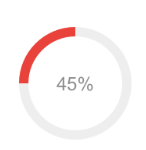

# 资产配比图表

## 功能

各个产品的资产配比图

## props

| 参数 | 说明 | 必填 | 类型 | 可选值 | 默认值 |
| --- | --- | --- | --- | --- | --- |
| value/v-model | 当前选择的分块 | 否 | Number | - | 0 |
| data | 数据 | 否 | Array | — | [] |

```js
data: [
  {
    value: 200,
    name: 'T+1'
  },
  {
    value: 200,
    name: 'T+1'
  }
]
```

## 默认组件名

`jd-echarts-match`

## 样式

- `default`


