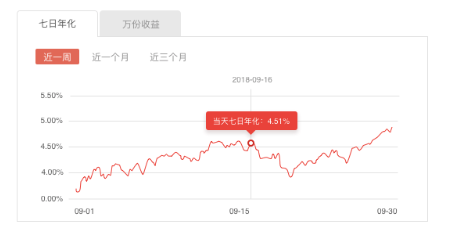

# 产品收益图表

## 功能

产品的历史收益，分为七日年化和万份收益

## props

| 参数 | 说明 | 必填 | 类型 | 可选值 | 默认值 |
| --- | --- | --- | --- | --- | --- |
| xData | x轴数据 | 否 | Array | - | [] |
| yData | y轴数据 | 否 | Array | — | [] |
| tabActive | 当前选中的tab类型 | 否 | Number | - | 0 |
| dateActive | 当前选中的时间分段类型 | 否 | Number | - | 0 |

## event

- `tabClickHandle`: 切换tab后触发的事件，回调参数(index)当前选中的索引
- `dateClickHandle`: 切换时间后触发的事件，回调参数(index)当前选中的索引

## 默认组件名

`jd-echarts-tab`

## 样式

- `default`

