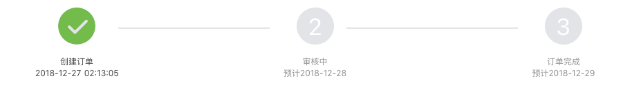

# 过程条

## 功能

过程的步骤显示

## props

| 参数 | 说明 | 必填 | 类型 | 可选值 | 默认值 |
| --- | --- | --- | --- | --- | --- |
| value | 当前到第几步 | 是 | Number | - | 1 |
| progress | 进度条 | 是 | Array | — | [] |

```js
progress: [
  {
    name: '', // 显示文字
    time: '' // 显示时间
  }
]
```

## 默认组件名

`jd-progress`

## 样式

- `default`


