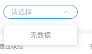

# 选择器

## 功能

下拉选择

## props

| 参数 | 说明 | 必填 | 类型 | 可选值 | 默认值 |
| --- | --- | --- | --- | --- | --- |
| value/v-model | 选中的值 | 否 | String | - | - |
| selectOptions | 下拉选择项 | 否 | Array | — | [] |

```js
selectOptions: [
  {
    label: '',
    value: ''
  }
]
```

## methods

- `clearHandle`: 清空选中的值

## 默认组件名

`jd-select`

## 样式

- `default`


