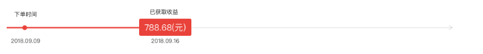

# 时间轴

## 功能

显示每个时间点对应的事

## props

| 参数 | 说明 | 必填 | 类型 | 可选值 | 默认值 |
| --- | --- | --- | --- | --- | --- |
| type | 当前组件类型 | 否 | String | normal(默认)/profit(收益时间轴) | normal |
| list | 时间轴 | 否 | Array | — | [] |

```js
list: [
  {
    name: '', // 显示文字
    time: '', // 显示时间
    step: 1, // 主要步骤 type 为 'normal'时生效
    profit: '', // 当前收益 type 为 'profit'时生效
  }
]
```

## 默认组件名

`jd-step-bar`

## 样式

- `normal`

- `profit`


