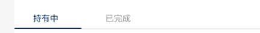

# tab切换

## 功能

tab切换

## 示例

::: 基础使用示例

```html
<template>
  <div>
    <span>csbank</span>
    <jd-tab :tabs="tabs" v-model="currentTab"></jd-tab>
  </div>
  <div style="padding-top: 20px;">
    <span>aibank</span>
    <jd-tab :tabs="tabs" v-model="currentTab" aibank></jd-tab>
  </div>
</template>
<script>
  export default {
    data() {
      return {
        tabs: [
          {
            label: '示例一',
            name: '1'
          },
          {
            label: '示例二',
            name: '2'
          }
        ],
        currentTab: '1'
      }
    }
  }
</script>
```

## props

| 参数 | 说明 | 必填 | 类型 | 可选值 | 默认值 |
| --- | --- | --- | --- | --- | --- |
| value/v-model | 当前选中 | 否 | String/Number | - | 0 |
| width | tab的宽度 | 否 | String | — | 340px |
| tabs | 展示的tab | 否 | Array | - | [] |
| aibank | 是否是aibank | 否 | Boolean | true/false | false |

```js
tabs: [
  {
    label: '', // 显示的文案
    name: '' // 对应显示的tab的name 赋给 value
  }
]
```

## event

- `handle-click`: 点击后触发的事件,回调参数(tab, event)

## 默认组件名

`jd-tab`

## 样式

- `default`

