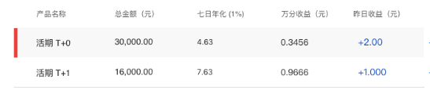

# 资产配比表格

## 功能

资产配比的表格

## 示例

::: 基础使用示例

```html
<template>
  <div></div>
</template>
<script>
export default {
  data() {
    return {

    }
  }
}
</script>
```

## props

| 参数 | 说明 | 必填 | 类型 | 可选值 | 默认值 |
| --- | --- | --- | --- | --- | --- |
| tableData | 表格数据 | 否 | Array | - | [] |
| columns | 表格表头数据 | 否 | Array | - | [] |
| hoverColumn | 当前哪一行高亮选中 | 否 | Number | — | 0 |

## event

- `hover-change`: 鼠标移入触发的事件，回调参数(index),当前选中的索引

## 默认组件名

`jd-table-match`

## 样式

- `default`


