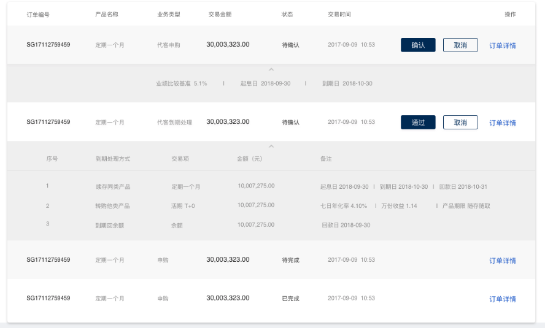

# 待处理事项的列表

## 功能

待处理事项的列表，包含拓展表格

## props

| 参数 | 说明 | 必填 | 类型 | 可选值 | 默认值 |
| --- | --- | --- | --- | --- | --- |
| data | 表格数据 | 否 | Array | - | [] |
| columns | 表格表头数据 | 否 | Array | - | [] |

```js
data: [
  {
    name: '活期T+0',
    type: '代客到期处理',
    amount: '30,003,323.00',
    orderId: 'SG17112759459',
    // 是否有拓展
    expand: true,
    // 拓展的数据
    expandData: {
      columns: [
        {
          label: '到期处理方式',
          prop: 'methods'
        },
        {
          label: '金额（元）',
          prop: 'amount'
        }
      ],
      data: [
        {
          methods: '存续同类产品',
          amount: '10,007,275.00',
        },
        {
          methods: '存续同类产品',
          amount: '10,007,275.00',
        },
        {
          methods: '存续同类产品',
          amount: '10,007,275.00',
        }
      ]
    }
  },
]
columns: [
  {
    label: '产品名称',
    prop: 'name',
    render: (scope) => {
      return (`
        <p style="color:#333;font-size:14px;line-height:17px;">${scope.row['name']}</p>
        <span style="color:#9B9B9B;font-size:12px;">编号 ${scope.row['orderId']}</span>
      `)
    }
  },
  {
    label: '订单类型',
    prop: 'type',
    render: (scope) => {
      return (`
        <span style="color:#999;font-size:12px;">${scope.row['type']}</span>
      `)
    }
  },
  {
    label: '交易金额',
    prop: 'amount',
    render: (scope) => {
      return (`
        <span style="font-size:14px;color:#333;">${scope.row['amount']}</span>
      `)
    }
  },
]
```

## 默认组件名

`jd-table-todo`

## 样式

- `default`

