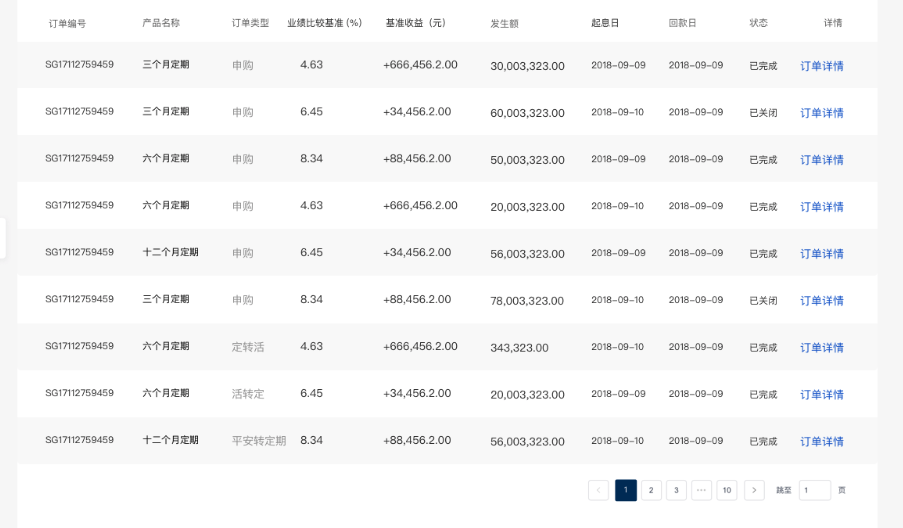

# 表格

## 功能

表格

## props

| 参数 | 说明 | 必填 | 类型 | 可选值 | 默认值 |
| --- | --- | --- | --- | --- | --- |
| tableData | 表格数据 | 否 | Array | - | [] |
| columns | 表头及内容格式定义 | 否 | Array | — | [] |
| isShowPage | 是否展示分页 | 否 | Boolean | true/false | true |
| firstAtOne | 第一行默认加深 | 否 | Boolean | true/false | false |
| showHeader | 是否展示表头 | 否 | Boolean | true/false | true |
| currentPage | 当前页码 | 否 | Number | - | 1 |
| total | 总条数 | 否 | Number | - | 1 |
| pageSize | 一页多少条 | 否 | Number | - | 10 |

```js
tableData: [
  {
    // 对应都是columns里面的prop
    name: '',
    age: ''
  }
]
columns: [
  {
    label: '', // 表头
    prop: '', // 对应的字段
    width: '', // 当前列宽度
    render: (scope) => {}, // 自定义渲染数据的格式
    slot: '', // 最后操作项自定义组件或者html，slot的值就是slot的name @augments { Object } row 当前列的数据
    filter: '' // 具有筛选功能，filter的值就是slot的name，@augments { Object } slotProps 当前表头的数据参数
  }
]
```


## event

- `current-change`: 页码变化，回调参数(page)

## slot

- `columns.slot`: prop: row

- `columns.filter`: prop: column

## 默认组件名

`jd-table`

## 样式

- `table`

